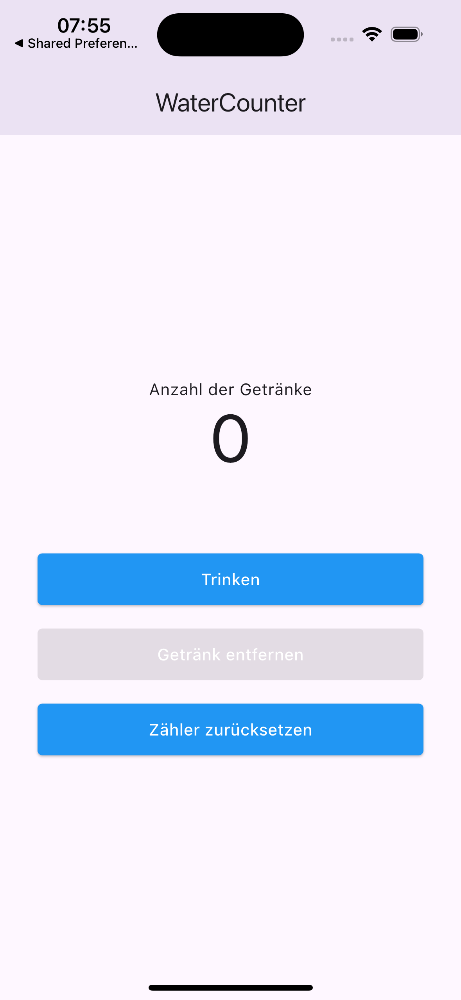

# water_counter

Eine kleine Flutter-App, die die Verwendung von `SharedPreferences` zeigt.
Sie ist SEHR simpel gestaltet.

## Screenshots

Home Screen                       |
:--------------------------------:
{width=150}